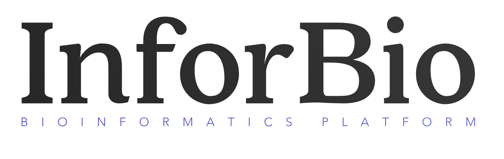

{ width="80%"}

# Welcome To the InforBio Online Training (IOT)!

The **InforBio** bioinformatics platform offers online,
small-group training courses designed to meet the needs of research laboratories.
Our programme aims to transfer the key skills you need to become independent in analysing your own data.

All training programs are structured into a series of modules,
with each module building upon the knowledge and skills acquired in the previous one.
One module lasts one week, during which participants dive into **online materials**
to ensure they understand and internalize the content.
Participants then complete **quizzes and exercises** using both public and
their own data to gauge their understanding,
receiving **personalized feedback** on their work.
To facilitate their learning, we provide access to computational resources such as Rstudio and Galaxy servers.
The module wraps up with a 3 hours training to recap
the week's material and address any questions.
These videoconferences are recorded and made available for later viewing,
ensuring continuous access to the learning resources.

## Training Tools

### Visio

We will use [Visio](https://lasuite.numerique.gouv.fr/produits/visio) for videoconferencing.

Please follow the rules for usage:

- Please be on time.
- Technical setup:  
  - Ensure your internet connection is stable.
  - Test your camera and microphone before the session.
- During the session:  
  - Keep your microphone muted unless you're speaking to avoid background noise.
  - Use the “Raise Hand” feature if you want to ask a question during the lecture.
  - Keep your camera on if possible to create a more interactive environment.
- Recorded sessions are for personal review only. Do not distribute them without permission.

### Tchap

Tchap is a dedicated workspace for communication and staying connected between sessions.

If you haven't already use it, you need to create a [Tchap account](https://tchap.gouv.fr/).

Then join the InforBio training Tchap group by searching for the space name: **InforBio-IOT-2026/2027**.

- Post messages in the correct channel, e.g., "questions" for asking about course content.
- When asking questions, please be specific and clear with a minimal context, include screenshots or error message to help others understand the issue.
- When discussing a question, please reply in the thread to avoid flooding the channel.

### Trello

Trello is a tool to help you stay organized and track your learning progress.

You will be invited to join a Trello board for each training program.
We will create one list per student, 
please add one card for each session to add your notes, summary, etc.
