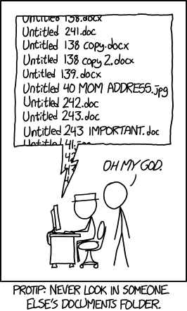

## Versions des packages

Parfois, on voit ces messages lors de l’exécution d’un script :

```r
Error in library(dplyr) : there is no package called ‘dplyr’
```

ou

```r
Error: package ‘dplyr’ version 1.1.0 required
but 0.8.5 is installed
```

## Gérer les versions de packages : [renv](https://rstudio.github.io/renv/)

Concept :

```bash
my_project
 ├ script.R
 ├ data/
 ├ renv.lock
 └ renv/
    └ library/ # la bibliothèque du projet
```

Chaque projet a ses propres versions des packages.

Avec le fichier `renv.lock` qui enregistre :

- versions packages
- dépendances

Commandes essentielles :

```{r}
#| eval: false

# Initialiser
renv::init()

# Installer packages
renv::install("dplyr") # depuis CRAN
renv::install("bioc::DESeq2") # depuis Bioconductor
renv::install("r-lib/rlang") # depuis un répertoire github

# Enregistrer l’état actuel des packages du projet
renv::snapshot() # mettre à jour le renv.lock

# Vérifier l'état actuel des packages du projet
renv::status()

# Restaurer
renv::restore() # restaurer les pkgs du projet à partir d'un renv.lock
```

Workflow simple :

1. créer projet RStudio
2. `renv::init()`
3. travailler normalement, `renv::install()` des packages
4. `renv::snapshot()` recorder l'info des packages avant de partager

`renv` utilise un cache global, donc quand un package est déjà installé avec la même version, `renv::install()` ne le recompilera pas. Il va simplement créer un lien vers le cache.


## Quelle modification ai-je faite ?



## Gérer les versions de codes: [Git](https://git-scm.com)

Git permet :

- historique du code
- revenir en arrière
- collaboration

Concepts simples :

commit = snapshot du code

Workflow : edit → commit → edit → commit → ... (→ push)

### Workflow Git local

```bash
git init                             # initialise un dépôt git
git add script_test.qmd              # ajoute un fichier au prochain commit
git commit -m "create a test script" # enregistre un snapshot
git log # check history              # montre l’historique
```

### Workflow avec dépôt distant (GitHub / GitLab)

Si on veut partager ou sauvegarder sur GitHub, on ajoute : `git push`

```bash
git init
git add script_test.qmd
git commit -m "create a test script"

git remote add origin https://github.com/user/project.git # le dépôt distant auquel je veux me connecter
git push -u origin main
```

